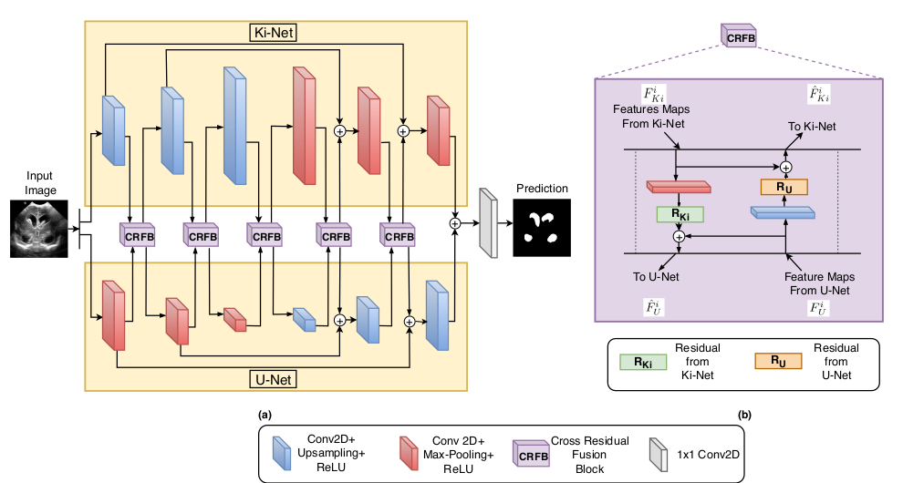

# KiU-Net-pytorch [](https://paperswithcode.com/sota/liver-segmentation-on-lits2017?p=kiu-net-overcomplete-convolutional)


 <a href="https://arxiv.org/abs/2006.04878"> Paper (Conference) </a> | <a href="https://arxiv.org/pdf/2010.01663.pdf"> Paper (Journal Extension) </a> | <a href="https://sites.google.com/view/kiunet/kiu-net"> Project Page </a>| <a href="https://drive.google.com/file/d/1YJYXrdgAF7-289-jwbCr7Gzut7UrK7Am/view"> Slides </a>


Official Pytorch Code for the paper ["KiU-Net: Towards Accurate Segmentation of Biomedical Images using Over-complete Representations"](https://arxiv.org/abs/2006.04878) , presented at MICCAI 2020 and its

Journal Extension:
["KiU-Net: Overcomplete Convolutional Architectures for Biomedical Image and Volumetric Segmentation" ](https://arxiv.org/pdf/2010.01663.pdf), IEEE Transactions on Medical Imaging (IEEE TMI)

# About this repo:

This repo hosts the code for the following networks:

1) KiU-Net 2D
2) KiU-Net 3D
3) Res-KiU-Net
4) Dense-KiU-Net

It also has dataloaders organized for generic 2D image segmentation and 3D volumetric segmentation for BraTS, LiTS dataset; for easy benchmarking of medical image and volumetric segmentation algorithms.


# Introduction

In a generic "encoder-decoder" architecture , the initial few blocks of the encoder learn low-level features of the data while the later blocks learn the high-level features. Eventually, the encoder learns to map the data to lower dimensionality (in the spatial sense). The increasing receptive field size over the depth of the network, constrains the network to focus more on the higher-level features. In our proposed architecture , we introduce Ki-Net where we use overcomplete representations which constraints the receptive field from increasing. This is done by a simple change in the architecture of encoder where max-pooling is replaced by up-sampling. This helps the filters in deep layers focus more on the low-level details helping in fine segmentation.  This network, when augmented with U-Net is termed as KiU-Net which results in significant improvements in the case of segmenting small anatomical landmarks and blurred noisy boundaries while obtaining better overall performance. More details can be found in the paper.

<p align="center">
  
</p>

### Prerequisites:

- Python 3.6
- Pytorch 1.4

<a href="https://pytorch.org/ "> Pytorch Installation </a>  


### Links for downloading the public Datasets:

1) GLAS Dataset - <a href="https://warwick.ac.uk/fac/sci/dcs/research/tia/glascontest/"> Link (Original) </a> | <a href = "https://drive.google.com/drive/folders/1dwhjqE0vC0KL_siGUeqMUq08KyO1bPKH?usp=sharing"> Link (Resized) </a> 
2) RITE Dataset - <a href="https://medicine.uiowa.edu/eye/rite-dataset"> Link (Original)</a> | <a href = "https://drive.google.com/drive/folders/1WTPRJk8Q-Bx-uqMyfoL9JHi7vKotwgL8?usp=sharing"> Link (Resized) </a> 
3) BraTS Dataset - <a href="https://www.med.upenn.edu/cbica/brats2020/data.html"> Link </a>  
4) LiTS Dataset - <a href="https://competitions.codalab.org/competitions/17094"> Link </a>  
5) Unfortunately, Brain Anatomy US dataset introduced in the paper cannot be made public because of pending IRB approval.

# Using the Code for your dataset

- Clone this repository:
```bash
git clone https://github.com/jeya-maria-jose/KiU-Net-pytorch
cd KiU-Net-pytorch
```


### Dataset Preparation

Prepare the dataset in the following format for easy use of the code. The train and test folders should contain two subfolders each: img and label. Make sure the images their corresponding segmentation masks are placed under these folders and have the same name for easy correspondance. Please change the data loaders to your need if you prefer not preparing the dataset in this format.


```bash
Train Folder-----
      img----
          0001.png
          0002.png
          .......
      label---
          0001.png
          0002.png
          .......
Validation Folder-----
      img----
          0001.png
          0002.png
          .......
      label---
          0001.png
          0002.png
          .......
Test Folder-----
      img----
          0001.png
          0002.png
          .......
      label---
          0001.png
          0002.png
          .......

```


- This code is written for binary segmentation of an grayscale image. For using RGB images, just change the number of channels in the first and last layers in kiunet class found in <code> arch/ae.py </code>. For using KiU-Net for segmentation of more than one class, change the number of channels in the softmax layer in kiunet class found in <code> arch/ae.py </code>. The code is written for images of dimenstions 128x128. Either resize your images to the exact dimension for using the code directly or make changes in the ratios in interpolation functions accordingly in case of using dimensions which are not powers of 2. 

- The ground truth images should have pixels corresponding to the labels. Example: In case of binary segmentation, the pixels in the GT should be 0 or 1.

### Training Command:

```bash 
python train.py --train_dataset "enter train directory" --val_dataset "enter validation directory" --direc 'path for results to be saved' --batch_size 1 --epoch 400 --save_freq 10 --modelname "kiunet" --learning_rate 0.0001
```

```bash
Change modelname to kiunet3d, reskiunet or densekiunet to train those architectures
```

### Testing Command:

```bash 
python test.py --loaddirec "./saved_model_path/model_name.pth" --val_dataset "test dataset directory" --direc 'path for results to be saved' --batch_size 1 --modelname "kiunet"
```

The results including predicted segmentations maps will be placed in the results folder along with the model weights. Run the performance metrics code in MATLAB for calculating DICE Coefficient and Jaccard Index.

# KiU-Net 3D:

The model file of KiU-Net 3D can be found at <code> arch/ae.py </code>.

### Using the Code for BraTS Dataset

Check out [readme](https://github.com/jeya-maria-jose/KiU-Net-pytorch/tree/master/BRATS) in "BRATS/" folder for details on training KiU-Net 3D for BraTS dataset.

### Using the Code for LiTS Dataset

Check out [readme](https://github.com/jeya-maria-jose/KiU-Net-pytorch/tree/master/LiTS) in "LiTS/" folder for details on training KiU-Net 3D for LiTS dataset.
 
### Acknowledgement:

The dataloader code is inspired from <a href="https://github.com/cosmic-cortex/pytorch-UNet"> pytorch-UNet </a>, [BraTS 2018 dataloader](https://github.com/ieee820/BraTS2018-tumor-segmentation) and [LiTS dataloader](https://github.com/assassint2017/MICCAI-LITS2017).

# Citation:

```bash 
@inproceedings{valanarasu2020kiu,
  title={KiU-Net: Towards Accurate Segmentation of Biomedical Images Using Over-Complete Representations},
  author={Valanarasu, Jeya Maria Jose and Sindagi, Vishwanath A and Hacihaliloglu, Ilker and Patel, Vishal M},
  booktitle={Medical Image Computing and Computer Assisted Intervention--MICCAI 2020: 23rd International Conference, Lima, Peru, October 4--8, 2020, Proceedings, Part IV 23},
  pages={363--373},
  year={2020},
  organization={Springer}
}
```
```bash
@article{valanarasu2021kiu,
  title={Kiu-net: Overcomplete convolutional architectures for biomedical image and volumetric segmentation},
  author={Valanarasu, Jeya Maria Jose and Sindagi, Vishwanath A and Hacihaliloglu, Ilker and Patel, Vishal M},
  journal={IEEE Transactions on Medical Imaging},
  year={2021},
  publisher={IEEE}
}
```
Open an issue in case of any queries or mail me directly.
